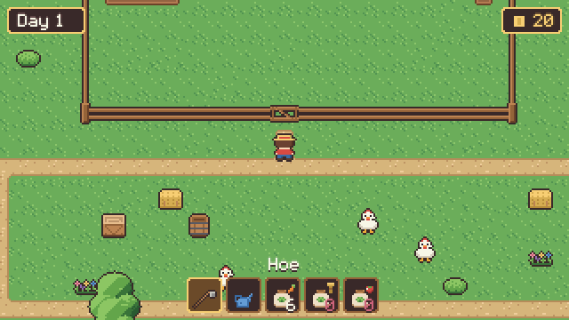

# Cozy Farm Starter

A tiny cozy farming game in plain JavaScript, and a template to build your own: **till, plant, water, harvest, ship**.
One HTML file for the engine, `config.js` for the map, crops, prices and texts. No engine, no build step, no dependencies.

**▶ Play it:** [aquumgifts.github.io/cozy-farm-starter](https://aquumgifts.github.io/cozy-farm-starter/) · also on [itch.io](https://aquumgifts.itch.io/cozy-farm-starter)

## Features

- Map written as text, one character per 16×16 tile; fences and paths connect by themselves
- Soil that autotiles as you till, from a standard 13-piece set (each tile is drawn as four 8×8 quarters, so 1-tile strips and lone tiles look right)
- Crops with growth stages and watering, a seed shop, shipping and a day cycle
- Chickens that wander and peck, saving in the browser, keyboard, mouse and touch controls

## Controls

Arrows / WASD walk · Space use the tool in front of you · 1-5 or Tab choose a tool or seed · M sound.
On phones: on-screen pad, A to use, B for the next tool.

## Make it yours

Edit `config.js`: draw a new map, change prices and growth speed, add crops (a 4-frame strip + an icon each).
The full [Cozy Farm](https://aquumgifts.itch.io/cozy-farm) pack has 7 more crops in exactly this format, animated water,
the farmhouse, barn and coop, 8 villagers, cows and a brown hen.

Run it locally with any static server, for example `python3 -m http.server 8000`, then open http://localhost:8000.

## Licenses

- **Code** (`index.html`, `config.js`): MIT, see [LICENSE](LICENSE).
- **Art, sounds and font** (`assets/`): [Cozy Farm Lite](https://aquumgifts.itch.io/cozy-farm), [Cozy Farm SFX](https://aquumgifts.itch.io/cozy-farm-sfx) and [Cozy Space Pixel Font](https://aquumgifts.itch.io/cozy-space-pixel-font) by Aquum Studio. Free to use in your games, see `assets/LICENSE-art.txt`. Please credit "Art and sound: Cozy Farm by Aquum Studio".

The art is drawn in code and text art and the sounds are synthesized with our own code. No AI image or sound generators were used.
